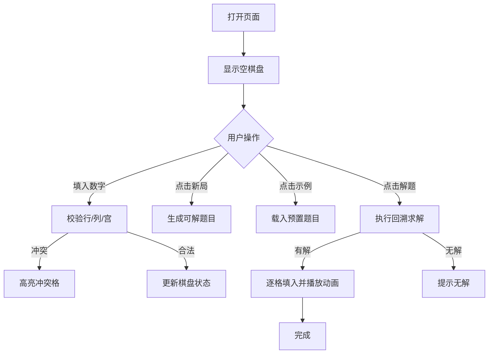

# 数独解题器 PRD

## 1. 产品概述
一个本地运行的数独解题网页：在 9×9 棋盘内手动填写题目，点击「解题」自动完成剩余填充，并提供新局、清空、示例题与解题动画。
目标用户：日常休闲玩家、想学回溯算法的同学、工作中摸鱼解闷的同事。

## 2. 核心功能

### 2.1 用户角色
无需登录，单用户单页面。

### 2.2 功能模块
1. **数独棋盘**：81 个可编辑格子，按 3×3 宫以更粗的边框分隔。
2. **解题引擎**：基于回溯 + 候选数剪枝，点击「解题」逐步填入剩余数字并配动画。
3. **工具栏**：新出题、清空、载入示例、撤销/重做、切换解题速度。
4. **状态提示**：当前难度、是否已解题、非法输入高亮、解题失败提示。

### 2.3 页面细节
| 页面 | 模块 | 功能描述 |
|------|------|----------|
| 解题页 | 棋盘 | 81 个 input，仅接受 1–9 与空；初始题目数字加粗锁定样式 |
| 解题页 | 工具栏 | 新局 / 示例 / 清空 / 撤销 / 重做 / 解题 / 暂停-继续 |
| 解题页 | 状态条 | 显示当前填入数、冲突数、解题进度（已解 / 共需解） |
| 解题页 | 设置 | 解题速度（慢/中/快/瞬间）、错误高亮开关 |

## 3. 核心流程

## 4. 用户界面设计

### 4.1 设计风格
- **主色**：墨绿 `#0F3D2E` 与米白 `#F5EFE6` 的报刊纸感配色。
- **强调色**：琥珀金 `#D4A24C`（高亮 / 按钮 hover），错误红 `#C0392B`（冲突提示）。
- **字体**：标题用 `Fraunces`（serif，display），数字与正文用 `JetBrains Mono`。
- **布局**：单列居中卡片，最大宽度 720px；棋盘四角点缀极细十字线，模拟纸本数独册。
- **按钮**：圆角 6px 矩形，带 1px 描边，hover 时下划线动效。
- **图标**：使用 `lucide-react`（Eraser、Sparkles、Undo2、Redo2、Play、Pause、RotateCcw）。

### 4.2 页面设计概览
| 区域 | 元素 | 风格描述 |
|------|------|----------|
| 顶部 | 标题 + 副标题 | Fraunces 大号 + 小号 serif 副标，居中 |
| 中部 | 9×9 棋盘 | 米白底，1px 浅灰线分隔格，3px 深色线分隔宫 |
| 中部 | 格子 | 用户输入使用 Mono 数字；已解题数字淡绿色 |
| 底部 | 工具栏 | 8 个图标按钮一字排开，hover 时数字上浮 |
| 底部 | 状态条 | 极细等宽字体，灰色 12px |

### 4.3 响应式
- 桌面端：棋盘 540px，按钮水平排列。
- 平板：棋盘 420px，按钮允许换行。
- 移动端：棋盘 320px，按钮 4 列网格。

### 4.4 3D 场景
不适用。
