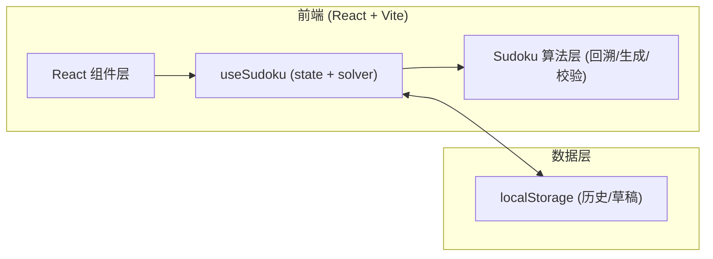

# 数独解题器 技术架构

## 1. 架构设计


## 2. 技术选型
- 前端框架：React 18 + TypeScript
- 构建工具：Vite 5
- 样式：Tailwind CSS 3 + 自定义 CSS 变量（报刊质感）
- 状态管理：React useState/useReducer（项目范围小，无需 zustand）
- 图标：`lucide-react`
- 算法：纯 TypeScript 回溯（bitmask 优化），零后端
- 持久化：localStorage 存储草稿与撤销栈

## 3. 路由定义
| 路径 | 用途 |
|------|------|
| / | 单页数独解题器（无路由切换） |

## 4. API 定义
无后端；所有逻辑在前端。

## 5. 数据模型
```ts
type CellValue = 0 | 1 | 2 | 3 | 4 | 5 | 6 | 7 | 8 | 9; // 0 = 空
type Board = CellValue[]; // 长度 81
type Given = boolean[];   // 长度 81，标识是否为初始题目（不可改）
type History = { board: Board; given: boolean }[];
```

## 6. 关键算法
- `validate(board, idx, num)`：检查 idx 处填 num 是否与所在行/列/宫冲突。
- `solve(board, animate?, delay?)`：返回首个解；带 `animate` 时将每一步入队供 UI 播放。
- `generate(difficulty)`：生成完整解 → 随机挖空 → 校验唯一解。
- `findConflicts(board)`：返回当前所有冲突坐标。

## 7. 目录结构
```
sudoku/
  src/
    components/
      Board.tsx
      Cell.tsx
      Toolbar.tsx
      StatusBar.tsx
    hooks/
      useSudoku.ts
    lib/
      sudoku.ts        // 算法
      puzzleBank.ts    // 预置示例题
    pages/
      SolverPage.tsx
    styles/
      index.css
    App.tsx
    main.tsx
  index.html
  package.json
  tailwind.config.js
  vite.config.ts
```
